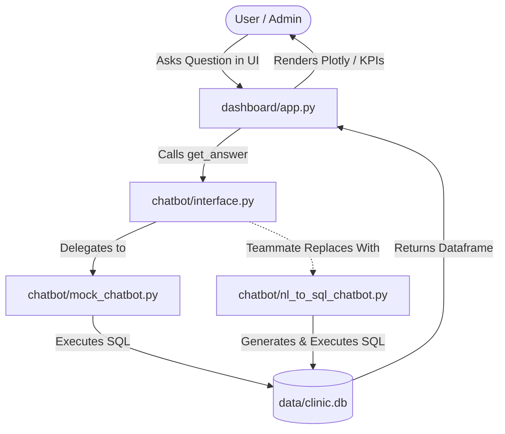

# 🏥 Smart Clinic Dashboard & Database Simulation

A college project simulating a modern **Clinic Management System**. The system features a 12-table relational database generated with realistic synthetic data, an interactive **Streamlit** executive dashboard with Plotly charts, and a clean natural language chatbot contract interface designed for team handoff.

---

## 👥 Division of Work (2-Person Split)

- **Contributor 1 (Current Build)**: Responsible for (1) designing the database schema & synthetic data generator, (2) building the Streamlit dashboard & Plotly visual components, and (3) defining the stable `ChatbotResponse` contract interface and mock implementation.
- **Contributor 2 (Teammate)**: Responsible for building the Natural Language chatbot engine (question → SQL query → structured response) in her own branch/folder using LLM / NL-to-SQL logic, connecting via the contract in `chatbot/interface.py`.

---

## 📐 Architecture & Repository Structure

```
clinic-project/
├── README.md                      # Master project documentation & setup guide
├── requirements.txt               # Python dependencies
├── pytest.ini                     # Pytest environment configuration
├── .gitignore                     # Git ignore rules (venv, __pycache__, DB)
├── data/
│   └── clinic.db                  # Generated SQLite database
├── database/
│   ├── schema.py                  # SQLAlchemy ORM models (12 tables)
│   ├── generate_data.py           # Idempotent synthetic data generator (~4,000 appointments)
│   └── db_utils.py                # Database connection engine & helper functions
├── dashboard/
│   ├── app.py                     # Main Streamlit dashboard application
│   ├── components/
│   │   ├── kpi_cards.py           # KPI metric card component
│   │   ├── charts.py              # Plotly interactive chart renderer
│   │   └── chat_input.py          # Chatbot question input & history interface
│   └── static/
│       └── style.css              # Custom glassmorphism CSS theme
├── chatbot/
│   ├── interface.py               # THE CONTRACT: ChatbotResponse TypedDict & get_answer()
│   ├── mock_chatbot.py            # Functional mock chatbot for demo/testing
│   └── README.md                  # Teammate onboarding & implementation instructions
└── tests/
    ├── test_database.py           # Database integrity, row count, & foreign key tests
    └── test_dashboard_contract.py # Generic contract compliance validator for get_answer()
```

### System Architecture Flow



---

## 🗄️ Database Schema Summary (12 Relational Tables)

Built using SQLAlchemy declarative models in [`database/schema.py`](file:///c:/Users/aicha/Documents/01_Studies/projects/stage/clinic-project/database/schema.py):
1. `patients`: Demographics, insurance details, blood types, contact info.
2. `departments`: Clinical departments and physical locations.
3. `doctors`: Medical staff, specialties, department assignments.
4. `staff`: Non-physician personnel (nurses, receptionists, lab techs).
5. `appointments`: Scheduling, timestamps, status (`scheduled`, `completed`, `cancelled`, `no-show`).
6. `visits`: Clinical encounter records linked to completed appointments.
7. `diagnoses`: ICD-10 coded clinical diagnoses and severity levels.
8. `medications`: Pharmaceutical catalog, unit pricing, and categories.
9. `prescriptions`: Medically plausible prescriptions linked to visit diagnoses.
10. `lab_tests`: Diagnostic lab test orders, results, and status.
11. `billing`: Patient invoices, insurance coverage, and payment status (`paid`, `pending`, `overdue`).
12. `payments`: Payment transaction logs and payment methods (`card`, `cash`, `insurance`).

---

## 🚀 Quickstart & Setup Guide

### 1. Environment Setup
Clone the repository and create a Python 3.11+ virtual environment:

```bash
# Windows PowerShell
python -m venv venv
.\venv\Scripts\Activate.ps1

# Linux / MacOS
python3 -m venv venv
source venv/bin/activate
```

### 2. Install Dependencies
```bash
pip install -r requirements.txt
```

### 3. Generate Synthetic Database
Run the idempotent data generator to reset and populate `data/clinic.db`:

```bash
python -m database.generate_data
```

*Expected output: Row counts summary for all 12 database tables (~400 patients, ~3,800 appointments, ~3,000 visits).*

### 4. Launch Interactive Streamlit Dashboard
```bash
streamlit run dashboard/app.py
```

Open your browser to `http://localhost:8501`.

---

## 🧪 Running Automated Tests

Run the test suite with `pytest`:

```bash
pytest
```

- `tests/test_database.py`: Validates database file existence, non-zero table counts, foreign key constraints, and absence of orphaned records.
- `tests/test_dashboard_contract.py`: Ensures `get_answer()` returns a valid `ChatbotResponse` shape that the Streamlit dashboard can render without errors.

---

## 🤝 Teammate Onboarding & Handover

For detailed instructions on how your teammate can implement the real Natural Language chatbot engine using an LLM / NL-to-SQL approach, refer to [`chatbot/README.md`](file:///c:/Users/aicha/Documents/01_Studies/projects/stage/clinic-project/chatbot/README.md).
